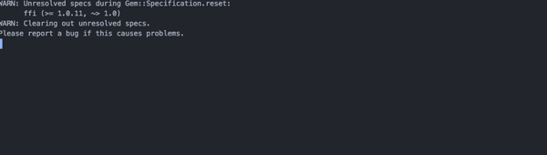

# AutoFollow

Instagram Auto Follow Bot - Gain ~50-100 new followers daily

# Instructions

1. Fork and Clone.
2. CD into folder.
3. Change out Username and Password variables to your own Instagram credentials.
4. Change out keywords/categories of people you are wanting to follow.
5. run 'ruby auto_follow.rb' in terminal.
6. Sit back and relax as you begin to follow people - you'll have follow backs in no time.
7. Program will run until it reaches maximum followings or unfollowings, which you can set.

If you want to quit early, feel free to do so.

I used this for 3 days, only running when I went to sleep and gained +260 followers.

Many people charge for programs such as these, Enjoy!

